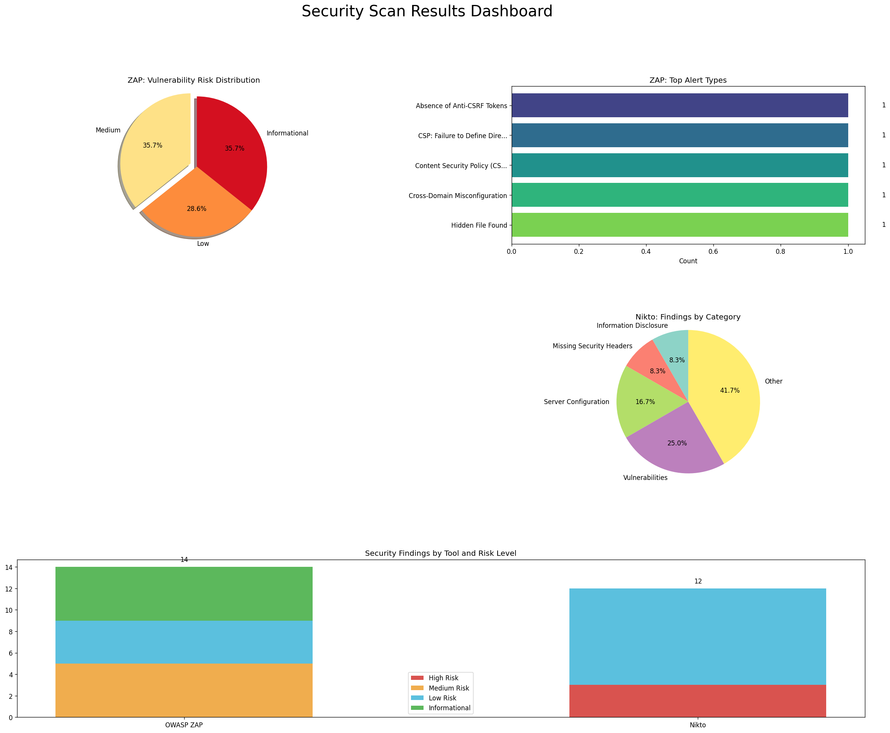

# Scan Results for portfolio.noahsmedberg.com

Scan started: 2025-04-14 11:50:35

Initializing scan... Please wait while we analyze the target.

## Scanning in progress

The scan is now running. Results will appear here as they are processed.

## Overall Security Posture Assessment

The security posture of the target website is generally good, with a few areas for improvement. The website is using HTTPS, which is a good start for securing data in transit. However, there are some high-risk issues that need to be addressed immediately.

## Most Significant Security Issues Identified

1. **Content Security Policy (CSP) Header Not Set**: The website does not have a Content Security Policy (CSP) header set, which can lead to cross-site scripting (XSS) attacks. A CSP header helps mitigate XSS by specifying which sources are allowed to load resources.

2. **Server Leaks Version Information**: The server is leaking version information via the "Server" HTTP response header field. This information can be used by attackers to identify known vulnerabilities in the server software.

3. **Strict-Transport-Security Header Not Set**: The website does not have the Strict-Transport-Security (HSTS) header set, which enforces secure connections. This can lead to man-in-the-middle attacks.

4. **Authentication Request Identified**: The website has an authentication request, which can be a target for brute force attacks.

## Key Recommendations in Order of Priority

1. **Implement a Content Security Policy (CSP)**: This is the highest priority as it mitigates XSS attacks. The CSP should be configured to restrict the sources of resources and scripts.

2. **Set the Strict-Transport-Security (HSTS) Header**: This will enforce secure connections and prevent man-in-the-middle attacks.

3. **Update Server Version Information**: Remove or obscure the server version information to prevent attackers from identifying known vulnerabilities.

4. **Review and Secure Authentication Mechanisms**: Ensure that authentication mechanisms are secure and resistant to brute force attacks.

5. **Regularly Update and Patch Software**: Keep all software up to date with the latest security patches to mitigate known vulnerabilities.

6. **Implement Additional Security Headers**: Use additional security headers like X-Frame-Options, X-XSS-Protection, and X-Content-Type-Options to further enhance security.

7. **Review and Secure File Permissions**: Ensure that file permissions are set correctly to prevent unauthorized access.

8. **Regularly Back Up Data**: Implement regular backups to protect against data loss.

9. **Educate Users on Security Best Practices**: Train users on security best practices to reduce the risk of security breaches.

By addressing these recommendations, the security posture of the website can be significantly improved.

## Absence of Anti-CSRF Tokens

### Issue Explanation
The vulnerability in question is a lack of anti-CSRF tokens in a web application. CSRF (Cross-Site Request Forgery) is a type of attack where an attacker tricks a user into submitting a request to a web application, which the user has authenticated with, without their knowledge. This can lead to unauthorized actions being performed on behalf of the user.

The absence of anti-CSRF tokens is a common misconfiguration that can lead to this vulnerability. Anti-CSRF tokens are unique, one-time-use tokens that are generated by the server and sent to the client. They are used to ensure that a request is coming from a legitimate source and not from an attacker.

In the context of the application's architecture, this vulnerability could manifest in various ways, such as:

- Forms that do not include anti-CSRF tokens in their submission.
- URLs that do not include anti-CSRF tokens in their parameters.
- APIs that do not require anti-CSRF tokens for authentication.

Detection of this vulnerability can be done through manual testing, where an attacker tries to submit a request to the application without the anti-CSRF token. Automated tools can also be used to scan for the absence of anti-CSRF tokens.

### Impact Analysis
The security implications of this vulnerability are significant. Attackers can exploit CSRF to perform actions on behalf of a user, such as:

- Changing account settings or personal information.
- Transferring funds or making purchases.
- Compromising sensitive data or credentials.

This vulnerability is relevant to various threat actor TTPs, such as:

- Credential stuffing: Attackers can use CSRF to log in to an account and attempt to use the credentials to access other services.
- Data exfiltration: Attackers can use CSRF to access sensitive data without the user's knowledge.
- Account takeover: Attackers can use CSRF to take over an account and perform actions on behalf of the user.

The vulnerability could also be used in conjunction with other vulnerabilities to bypass security controls. For example, if an attacker has compromised a user's session, they can use CSRF to perform actions without the need for additional authentication.

From a risk management perspective, this vulnerability aligns with several risk management frameworks and compliance requirements:

- PCI-DSS: CSRF can be used to perform unauthorized transactions, which is a violation of PCI-DSS requirements.
- HIPAA: CSRF can lead to unauthorized access to protected health information (PHI), which is a violation of HIPAA requirements.

### Exploitation Details
Advanced exploitation of this vulnerability could involve:

- Using CSRF to bypass multi-factor authentication mechanisms.
- Exploiting CSRF to perform actions that are not directly related to the user's session, such as accessing sensitive data or performing administrative actions.
- Using CSRF to escalate privileges or access sensitive information within the application.

Prerequisites for advanced exploitation include:

- Knowledge of the application's session management and authentication mechanisms.
- Ability to craft malicious requests that are not easily detectable by the application.
- Access to tools and frameworks that can assist in the exploitation process, such as Burp Suite or custom exploit development tools.

Potential indicators of compromise (IoCs) associated with exploitation attempts include:

- Unusual patterns in application logs or server logs.
- Unexpected changes in user account settings or data.
- Presence of unauthorized requests or actions in the application's audit logs.

### Step-by-Step Remediation
To mitigate this vulnerability, organizations should:

- Implement anti-CSRF tokens in all forms and URLs that perform state-changing actions.
- Use secure, stateless authentication mechanisms that do not rely on session tokens.
- Regularly update and patch all software components to ensure they are not vulnerable to known CSRF exploits.
- Conduct regular security code reviews and vulnerability assessments to identify and remediate CSRF vulnerabilities.
- Implement least privilege access controls to limit the impact of a successful CSRF attack.

If immediate remediation is not feasible, organizations can use compensating controls, such as:

- Monitoring and alerting for unusual patterns that may indicate CSRF attempts.
- Implementing rate limiting to slow down or prevent automated CSRF attempts.
- Using web application firewalls (WAFs) to detect and block malicious requests.

### References & Best Practices
- OWASP CSRF Prevention Cheat Sheet: Provides detailed guidance on how to prevent CSRF attacks.
- OWASP Top 10: Includes a category on CSRF, which provides guidance on how to prevent and mitigate CSRF attacks.
- SANS Institute: Has resources on secure coding practices and vulnerability mitigation strategies that can be applied to CSRF.
- MITRE ATT&CK: Includes techniques related to CSRF, which can be used to understand how attackers exploit these types of vulnerabilities.
- Exploit-DB: Contains a list of exploits related to CSRF, which can be used to understand the current state of exploitation techniques.

By leveraging these resources, organizations can gain a deeper understanding of the vulnerability, its exploitation potential, and the best practices for mitigating it.

---

## Content Security Policy (CSP) Header Not Set

### Issue Explanation
The vulnerability in question is related to the absence of a Content Security Policy (CSP) header in the HTTP response. CSP is a security mechanism that helps protect against cross-site scripting (XSS) and other code injection attacks by specifying which dynamic resources are allowed to load on a page.

Without a CSP header, the browser has no guidance on which resources are safe to load, which can lead to the execution of malicious scripts or the injection of malicious content. This can happen if an attacker is able to inject a script into the page, which can then be executed by the browser.

Common misconfigurations that lead to this vulnerability include:

- Not setting the CSP header at all.
- Setting a CSP header with too permissive policies, allowing all resources to load.
- Not updating the CSP header when the application changes, leading to outdated policies.

In the context of the application's architecture, this vulnerability can manifest in various ways:

- If the application allows user input to be reflected back in the response without proper sanitization, an attacker could inject malicious scripts.
- If the application includes third-party scripts or resources without proper validation, an attacker could inject malicious scripts into those resources.
- If the application uses inline scripts or styles, an attacker could inject malicious code into those as well.

Detection of this vulnerability can be done by checking the HTTP response headers for the presence of the CSP header. Tools like CSP Evaluator can be used to analyze the CSP policy and identify any issues.

### Impact Analysis
The security implications of this vulnerability are significant. Without a CSP header, the application is vulnerable to various types of attacks, including:

- Cross-site scripting (XSS): Attackers can inject malicious scripts into the page, which can steal sensitive information, perform actions on behalf of the user, or redirect the user to malicious sites.
- Data injection: Attackers can inject malicious content into the application, leading to data manipulation or data exfiltration.
- Resource injection: Attackers can inject malicious resources, such as images or scripts, which can be used to execute arbitrary code.

This vulnerability is relevant to various threat actor TTPs, such as:

- Credential dumping: Attackers could use XSS to steal cookies or session tokens, which could be used to access sensitive information or services.
- Phishing: Attackers could use XSS to inject malicious scripts into the page, which could be used to steal credentials or perform other malicious actions.
- Lateral movement: If an attacker has compromised one system, they could use XSS to move laterally within the network, accessing other systems and data.

The vulnerability could also be used in conjunction with other vulnerabilities to bypass security controls. For example, if an attacker has already compromised a system and is looking to escalate privileges, they could use XSS to execute code with higher privileges.

From a risk management perspective, this vulnerability aligns with several risk management frameworks and compliance requirements:

- PCI-DSS: This vulnerability could lead to unauthorized access to cardholder data, which is a violation of PCI-DSS requirements.
- HIPAA: If the application processes protected health information (PHI), this vulnerability could lead to unauthorized access to PHI, which is a violation of HIPAA requirements.

### Exploitation Details
Advanced exploitation of this vulnerability could involve:

- Using more sophisticated XSS payloads that are less likely to be detected by simple signature-based detection mechanisms.
- Exploiting the vulnerability to execute code that establishes a persistent backdoor, allowing attackers to maintain access even after initial exploitation.
- Using the vulnerability to bypass security controls, such as WAFs or IDS/IPS systems, by crafting payloads that are not easily detectable.

Prerequisites for advanced exploitation include:

- Deep knowledge of the application's codebase and the specific vulnerability.
- Ability to craft complex payloads that are both effective and stealthy.
- Access to tools and frameworks that can assist in the exploitation process, such as XSStrike or custom exploit development tools.

Potential indicators of compromise (IoCs) associated with exploitation attempts include:

- Unusual patterns in the application's behavior, such as unexpected script execution or data manipulation.
- Presence of unknown or suspicious scripts or resources in the page source.
- Unexpected spikes in network traffic or data transfer volumes.

### Step-by-Step Remediation
To mitigate this vulnerability, organizations should:

- Implement a CSP header with strict policies that specify only the trusted sources of content.
- Regularly update the CSP header as the application changes to ensure the policies remain current.
- Use a web application firewall (WAF) to help detect and block malicious requests.
- Conduct regular security code reviews and vulnerability assessments to identify and remediate vulnerabilities.
- Educate developers on secure coding practices to prevent injection vulnerabilities.

If immediate remediation is not feasible, organizations can use compensating controls, such as:

- Monitoring and alerting for unusual patterns that may indicate exploitation attempts.
- Implementing rate limiting to slow down or prevent automated exploitation attempts.
- Using intrusion detection and prevention systems to detect and block malicious traffic.

### References & Best Practices
- OWASP CSP Cheat Sheet: Provides guidance on implementing CSP and managing CSP policies.
- CSP Evaluator: A tool for analyzing CSP policies and identifying issues.
- SANS Institute: The SANS Institute has resources on secure coding practices and vulnerability mitigation strategies that can be applied to this type of vulnerability.
- MITRE ATT&CK: The MITRE ATT&CK framework includes techniques related to XSS, which can be used to understand how attackers exploit these types of vulnerabilities.
- Exploit-DB: Exploit-DB contains a list of exploits related to XSS, which can be used to understand the current state of exploitation techniques.

By leveraging these resources, organizations can gain a deeper understanding of the vulnerability, its exploitation potential, and the best practices for mitigating it.

---

## Cross-Domain Misconfiguration

### Issue Explanation
The vulnerability in question is a cross-origin resource sharing (CORS) misconfiguration. CORS is a mechanism that allows web applications to make requests to resources from different origins without the need for a proxy. However, if not properly configured, it can lead to security issues.

The specific vulnerability occurs when the web server allows any origin to make requests to the server, without proper authentication or authorization checks. This can allow an attacker to make unauthorized requests to the server, potentially accessing sensitive data or performing actions on behalf of the user.

Common misconfigurations that lead to this vulnerability include:

- Not setting the "Access-Control-Allow-Origin" header to a specific origin or a list of allowed origins.
- Allowing the "*" wildcard in the "Access-Control-Allow-Origin" header, which allows any origin to make requests.
- Not implementing proper authentication or authorization checks before allowing CORS requests.

In the context of the application's architecture, this vulnerability could manifest in various ways, such as:

- An attacker could make requests to the server from a different domain and access sensitive data without the user's knowledge.
- The attacker could perform actions on behalf of the user, such as making API calls or submitting forms, without the user's consent.

Detection of this vulnerability can be done by checking the "Access-Control-Allow-Origin" header in the HTTP response. If the header is set to "*" or if it allows any origin, it indicates a potential vulnerability.

### Impact Analysis
The security implications of this vulnerability are significant. It can lead to unauthorized access to sensitive data, data manipulation, and potential account takeover. Attackers could use this vulnerability to:

- Extract sensitive information from the server, such as personal data, credentials, or proprietary information.
- Perform actions on behalf of the user, such as making payments, transferring funds, or accessing restricted areas of the application.
- Bypass security controls that rely on the Same Origin Policy (SOP), allowing them to access resources that should be protected.

This vulnerability is relevant to various threat actor TTPs, such as:

- Credential stuffing: Attackers could use this vulnerability to access accounts by making requests to the server and using the obtained credentials.
- Data exfiltration: Sensitive data could be accessed and sent to an attacker-controlled server.
- Account takeover: Attackers could gain unauthorized access to user accounts and perform actions on behalf of the user.

The vulnerability could also be used in conjunction with other vulnerabilities to bypass security controls. For example, if an attacker has already compromised a user's browser, they could use this vulnerability to make requests to the server and perform actions without the user's knowledge.

From a risk management perspective, this vulnerability aligns with several risk management frameworks and compliance requirements:

- PCI-DSS: This vulnerability could lead to unauthorized access to cardholder data, which is a violation of PCI-DSS requirements.
- GDPR: If the application processes personal data, this vulnerability could lead to unauthorized access to personal data, which is a violation of GDPR requirements.

### Exploitation Details
Advanced exploitation of this vulnerability could involve:

- Using more sophisticated techniques to bypass CORS checks, such as using CORS misconfigurations or exploiting other vulnerabilities that allow for cross-domain requests.
- Exploiting the vulnerability to access sensitive data or perform actions that are not directly related to the initial request, such as accessing user accounts or performing financial transactions.
- Using the vulnerability to establish a persistent backdoor, allowing attackers to maintain access even after initial exploitation.

Prerequisites for advanced exploitation include:

- Deep knowledge of the application's architecture and the specific CORS misconfiguration.
- Ability to craft requests that exploit the misconfiguration without triggering security mechanisms.
- Access to tools and frameworks that can assist in the exploitation process, such as browser extensions or custom scripts.

Potential indicators of compromise (IoCs) associated with exploitation attempts include:

- Unusual patterns in network traffic, such as requests from unexpected domains or IP addresses.
- Presence of unauthorized cookies or tokens in the browser.
- Unexpected changes in the application's behavior or data.

### Step-by-Step Remediation
To mitigate this vulnerability, organizations should:

- Implement proper CORS configuration, setting the "Access-Control-Allow-Origin" header to a specific origin or a list of allowed origins.
- Use the "Access-Control-Allow-Credentials" header to indicate that the server is willing to expose sensitive data to the request origin.
- Implement proper authentication and authorization checks before allowing CORS requests.
- Regularly review and update CORS configurations to ensure they are secure.
- Use web application firewalls (WAFs) to help detect and block unauthorized CORS requests.
- Conduct regular security code reviews and vulnerability assessments to identify and remediate vulnerabilities.

If immediate remediation is not feasible, organizations can use compensating controls, such as:

- Monitoring and alerting for unusual CORS requests that may indicate exploitation attempts.
- Implementing rate limiting to slow down or prevent automated exploitation attempts.
- Using intrusion detection and prevention systems to detect and block unauthorized CORS requests.

### References & Best Practices
- OWASP CORS Misconfiguration: OWASP has a dedicated page on CORS misconfigurations, which provides guidance on how to properly configure CORS and avoid vulnerabilities.
- SANS Institute: The SANS Institute has resources on secure coding practices and vulnerability mitigation strategies that can be applied to this type of vulnerability.
- MITRE ATT&CK: The MITRE ATT&CK framework includes techniques related to cross-origin resource sharing, which can be used to understand how attackers exploit these types of vulnerabilities.
- Exploit-DB: Exploit-DB contains a list of exploits related to CORS misconfigurations, which can be used to understand the current state of exploitation techniques.

By leveraging these resources, organizations can gain a deeper understanding of the vulnerability, its exploitation potential, and the best practices for mitigating it.

---

## Hidden File Found

### Issue Explanation
The vulnerability in question is related to the exposure of sensitive files that should not be accessible to unauthorized users. This can occur due to misconfigurations, outdated software, or insufficient access controls.

The specific vulnerability could be related to:

- Misconfigured file permissions that allow public access to sensitive files.
- Outdated software that has known vulnerabilities that can be exploited to access sensitive files.
- Insufficient access controls that do not properly restrict access to sensitive files.

In the context of the application's architecture, this vulnerability could manifest in various ways, such as:

- Sensitive files being stored in a directory that is publicly accessible.
- Sensitive files being served by a web server without proper authentication or authorization checks.
- Sensitive files being exposed through a misconfigured application or service.

Detection of this vulnerability can be challenging, as it often requires manual review of file permissions, configurations, and access controls. Automated tools can help identify potential issues, but manual verification is often necessary to confirm the vulnerability.

### Impact Analysis
The security implications of this vulnerability are significant. It can lead to unauthorized access to sensitive data, which can be used for various malicious purposes, such as:

- Credential dumping: Sensitive files containing credentials could be accessed and used to gain unauthorized access to other systems.
- Data exfiltration: Sensitive data could be extracted and sent to an attacker-controlled server.
- System compromise: If sensitive files contain configuration information or credentials, an attacker could use this information to compromise the system.

This vulnerability is relevant to various threat actor TTPs, such as:

- Credential stuffing: Attackers could use the exposed credentials to attempt to log in to other systems.
- Data exfiltration: Sensitive data could be extracted and used for further attacks or sold on the dark web.
- System compromise: Attackers could use the exposed credentials to gain access to the system and escalate privileges.

The vulnerability could also be used in conjunction with other vulnerabilities to bypass security controls. For example, if an attacker has compromised a system and is looking to escalate privileges, they could use the exposed sensitive files to gain access to credentials or configuration information.

From a risk management perspective, this vulnerability aligns with several risk management frameworks and compliance requirements:

- PCI-DSS: Exposing sensitive files could lead to unauthorized access to cardholder data, which is a violation of PCI-DSS requirements.
- HIPAA: If the files contain protected health information (PHI), the exposure could lead to unauthorized access to PHI, which is a violation of HIPAA requirements.

### Exploitation Details
Advanced exploitation of this vulnerability could involve:

- Using more sophisticated techniques to extract sensitive information from the exposed files.
- Exploiting the vulnerability to establish a persistent backdoor, allowing attackers to maintain access even after initial exploitation.
- Using the exposed files to bypass security controls, such as WAFs or IDS/IPS systems, by crafting payloads that are not easily detectable.

Prerequisites for advanced exploitation include:

- Deep knowledge of the system's file structure and the specific sensitive files.
- Ability to craft complex payloads that are both effective and stealthy.
- Access to tools and frameworks that can assist in the exploitation process, such as Metasploit or custom exploit development tools.

Potential indicators of compromise (IoCs) associated with exploitation attempts include:

- Unusual patterns in file access logs or other system logs.
- Presence of unknown or suspicious processes or services on the system.
- Unexpected changes in file permissions or configurations.

### Step-by-Step Remediation
To mitigate this vulnerability, organizations should:

- Regularly review and audit file permissions to ensure they are set correctly and do not allow public access to sensitive files.
- Update and patch all software components to ensure they are not vulnerable to known exploits.
- Implement access controls, such as file system ACLs or directory permissions, to restrict access to sensitive files.
- Conduct regular security code reviews and vulnerability assessments to identify and remediate vulnerabilities.
- Educate users on the importance of not sharing sensitive files and the risks associated with doing so.

If immediate remediation is not feasible, organizations can use compensating controls, such as:

- Monitoring and alerting for unusual file access patterns that may indicate exploitation attempts.
- Implementing file integrity monitoring to detect unauthorized changes to sensitive files.
- Using intrusion detection and prevention systems to detect and block unauthorized access attempts.

### References & Best Practices
- CVE-2017-5638: This CVE details a similar vulnerability in the Apache Struts framework, which can be used as a reference for understanding the technical details of file exposure vulnerabilities.
- OWASP Top 10: The OWASP Top 10 includes a category on misconfiguration vulnerabilities, which provides guidance on how to prevent and mitigate misconfiguration issues.
- SANS Institute: The SANS Institute has resources on secure coding practices and vulnerability mitigation strategies that can be applied to this type of vulnerability.
- MITRE ATT&CK: The MITRE ATT&CK framework includes techniques related to credential access, which can be used to understand how attackers exploit file exposure vulnerabilities.
- Exploit-DB: Exploit-DB contains a list of exploits related to file exposure, which can be used to understand the current state of exploitation techniques.

By leveraging these resources, organizations can gain a deeper understanding of the vulnerability, its exploitation potential, and the best practices for mitigating it.

---

## Cross-Domain JavaScript Source File Inclusion

### Issue Explanation
The vulnerability in question is a cross-domain JavaScript source file inclusion vulnerability. This occurs when a web application includes JavaScript files from a third-party domain that is not trusted. This can lead to the execution of malicious code on the client-side.

The mechanism of this vulnerability involves the use of the `<script>` tag to include external JavaScript files. If an attacker can control the content of these files, they can execute arbitrary code in the context of the web application.

Common misconfigurations that lead to this vulnerability include:

- Not validating the source of the JavaScript files before including them.
- Using relative paths for the JavaScript files, which can be manipulated by an attacker.
- Not using Content Security Policy (CSP) to restrict the sources of JavaScript files.

In the context of the application's architecture, this vulnerability can manifest in various ways, such as:

- Including JavaScript files from a compromised server that contains malicious code.
- Using a CDN that has been compromised and serves malicious content.
- Including JavaScript files from a server that has been taken over by an attacker.

Detection of this vulnerability can be challenging, as it requires analyzing the application's code to determine if it includes external JavaScript files without proper validation. Static analysis tools can help identify potential vulnerabilities, but dynamic analysis is often necessary to confirm the vulnerability.

False positives can occur if the application includes legitimate JavaScript files from a third-party service that is not properly configured to use HTTPS or has other security issues.

### Impact Analysis
The security implications of this vulnerability are significant. It can lead to unauthorized execution of code on the client-side, which can be used to:

- Steal sensitive information from the client's browser, such as cookies, session tokens, or personal data.
- Perform client-side attacks, such as phishing or social engineering.
- Compromise the client's machine, leading to further exploitation.

This vulnerability is relevant to various threat actor TTPs, such as:

- Credential theft: Attackers could use this vulnerability to steal session tokens or credentials from the client's browser.
- Phishing: Malicious JavaScript code could be used to perform phishing attacks, tricking users into providing sensitive information.
- Lateral movement: If an attacker has compromised a client's machine, they could use this vulnerability to execute code on other machines within the network.

The vulnerability could also be used in conjunction with other vulnerabilities to bypass security controls. For example, if an attacker has already compromised a client's machine, they could use this vulnerability to execute code that helps them maintain persistence or escalate privileges.

From a risk management perspective, this vulnerability aligns with several risk management frameworks and compliance requirements:

- PCI-DSS: This vulnerability could lead to unauthorized access to cardholder data, which is a violation of PCI-DSS requirements.
- HIPAA: If the application processes protected health information (PHI), this vulnerability could lead to unauthorized access to PHI, which is a violation of HIPAA requirements.

### Exploitation Details
Advanced exploitation of this vulnerability could involve:

- Using more sophisticated techniques to bypass security controls, such as obfuscating the malicious code or using encryption.
- Exploiting the vulnerability to execute code that establishes a persistent backdoor, allowing attackers to maintain access even after initial exploitation.
- Using the vulnerability to bypass security controls, such as browser extensions or plugins, by crafting payloads that are not easily detectable.

Prerequisites for advanced exploitation include:

- Deep knowledge of the application's codebase and the specific vulnerability.
- Ability to craft complex payloads that are both effective and stealthy.
- Access to tools and frameworks that can assist in the exploitation process, such as browser extensions or custom exploit development tools.

Potential indicators of compromise (IoCs) associated with exploitation attempts include:

- Unusual patterns in JavaScript execution, such as unexpected calls to external APIs or unusual network traffic.
- Presence of unknown or suspicious browser extensions or plugins.
- Unexpected changes in the behavior of the web application or the client's machine.

### Step-by-Step Remediation
To mitigate this vulnerability, organizations should:

- Implement a Content Security Policy (CSP) to restrict the sources of JavaScript files and prevent the inclusion of external scripts.
- Validate and sanitize all JavaScript file sources before including them in the application.
- Use a web application firewall (WAF) to help detect and block malicious requests.
- Regularly update and patch all browser extensions and plugins to ensure they are not vulnerable to known exploits.
- Conduct regular security code reviews and vulnerability assessments to identify and remediate vulnerabilities.
- Implement least privilege access controls to limit the impact of a successful exploitation attempt.

If immediate remediation is not feasible, organizations can use compensating controls, such as:

- Monitoring and alerting for unusual patterns that may indicate exploitation attempts.
- Implementing rate limiting to slow down or prevent automated exploitation attempts.
- Using intrusion detection and prevention systems to detect and block malicious traffic.

### References & Best Practices
- CVE-2014-3704: This CVE details a similar vulnerability in the jQuery library, which can be used as a reference for understanding the technical details of cross-domain JavaScript source file inclusion vulnerabilities.
- OWASP Top 10: The OWASP Top 10 includes a category on client-side security, which provides guidance on how to prevent and mitigate client-side attacks.
- SANS Institute: The SANS Institute has resources on secure coding practices and vulnerability mitigation strategies that can be applied to this type of vulnerability.
- MITRE ATT&CK: The MITRE ATT&CK framework includes techniques related to client-side attacks, which can be used to understand how attackers exploit these types of vulnerabilities.
- Exploit-DB: Exploit-DB contains a list of exploits related to cross-domain JavaScript source file inclusion, which can be used to understand the current state of exploitation techniques.

By leveraging these resources, organizations can gain a deeper understanding of the vulnerability, its exploitation potential, and the best practices for mitigating it.

---

## Server Leaks Information via "X-Powered-By" HTTP Response Header Field(s)

### Issue Explanation
The vulnerability in question is related to the disclosure of sensitive information through the use of the "X-Powered-By" HTTP response header field. This header is used by web servers and application servers to indicate the software or framework that is powering the web application. However, this information can be valuable to attackers, as it can help them identify other frameworks or components that the application is using, which may have known vulnerabilities.

The "X-Powered-By" header is a common misconfiguration across different technology stacks. It is often set by default in web servers and application servers, and it is not always necessary for the application to function correctly. This makes it a prime target for attackers looking to gather information about the application's technology stack.

In the context of the application's architecture, this vulnerability can manifest in various ways. For example, if the application is using a web server that discloses this information, an attacker can easily identify the server version and potentially find known vulnerabilities associated with that version.

Detection of this vulnerability is relatively straightforward. Security tools can scan the HTTP response headers and look for the presence of the "X-Powered-By" header. However, it's important to note that some legitimate uses of the "X-Powered-By" header may be necessary for certain applications or frameworks, so false positives can occur.

### Impact Analysis
The security implications of this vulnerability are mainly related to the information disclosure aspect. By knowing the technology stack of the application, attackers can:

- Research known vulnerabilities associated with the disclosed frameworks or components.
- Craft targeted attacks that exploit specific vulnerabilities in the disclosed technologies.
- Use the information to plan further attacks, such as social engineering or phishing, by impersonating the application or its components.

This vulnerability is relevant to various threat actor TTPs, such as:

- Reconnaissance: Attackers can use this information to gather intelligence about the application and its environment.
- Exploitation: Once the technology stack is known, attackers can search for and exploit specific vulnerabilities.
- Lateral movement: If the application is part of a larger network, attackers can use this information to move laterally within the network.

From a risk management perspective, this vulnerability aligns with several risk management frameworks and compliance requirements:

- PCI-DSS: The disclosure of sensitive information, such as server versions, could lead to unauthorized access to cardholder data, which is a violation of PCI-DSS requirements.
- HIPAA: If the application processes protected health information (PHI), the disclosure of sensitive information could lead to unauthorized access to PHI, which is a violation of HIPAA requirements.

### Exploitation Details
Advanced exploitation of this vulnerability could involve:

- Using the disclosed information to craft targeted phishing emails or social engineering attacks.
- Exploiting known vulnerabilities in the disclosed frameworks or components.
- Using the information to bypass security controls, such as WAFs or IDS/IPS systems, by crafting requests that are not easily detectable.

Prerequisites for advanced exploitation include:

- Knowledge of the disclosed frameworks or components and their known vulnerabilities.
- Ability to craft targeted attacks based on the disclosed information.
- Access to tools and frameworks that can assist in the exploitation process, such as Metasploit or custom exploit development tools.

Potential indicators of compromise (IoCs) associated with exploitation attempts include:

- Unusual patterns in network traffic or application behavior that correspond to the disclosed frameworks or components.
- Presence of unknown or suspicious processes or services on the server that correspond to the disclosed information.

### Step-by-Step Remediation
To mitigate this vulnerability, organizations should:

- Configure the web server or application server to suppress the "X-Powered-By" header. This can be done through server configuration files or using middleware that filters out sensitive headers.
- Regularly update and patch all software components to ensure they are not vulnerable to known exploits.
- Conduct regular security code reviews and vulnerability assessments to identify and remediate vulnerabilities.
- Implement least privilege access controls to limit the impact of a successful exploitation attempt.
- Use a web application firewall (WAF) to help detect and block malicious requests that exploit the disclosed information.

If immediate remediation is not feasible, organizations can use compensating controls, such as:

- Monitoring and alerting for unusual patterns that may indicate exploitation attempts.
- Implementing rate limiting to slow down or prevent automated exploitation attempts.
- Using intrusion detection and prevention systems to detect and block malicious traffic that exploits the disclosed information.

### References & Best Practices
- OWASP Top 10: The OWASP Top 10 includes a category on information leakage, which provides guidance on how to prevent and mitigate information disclosure vulnerabilities.
- SANS Institute: The SANS Institute has resources on secure coding practices and vulnerability mitigation strategies that can be applied to this type of vulnerability.
- MITRE ATT&CK: The MITRE ATT&CK framework includes techniques related to reconnaissance, which can be used to understand how attackers exploit information disclosure vulnerabilities.
- Exploit-DB: Exploit-DB contains a list of exploits related to information disclosure, which can be used to understand the current state of exploitation techniques.

By leveraging these resources, organizations can gain a deeper understanding of the vulnerability, its exploitation potential, and the best practices for mitigating it.

---

## Server Leaks Version Information via "Server" HTTP Response Header Field

### Issue Explanation
The vulnerability in question is the disclosure of version information via the "Server" HTTP response header field. This header is used by web servers to identify the software and version they are running. However, disclosing this information can be a security risk because it can help attackers identify known vulnerabilities specific to that version.

The "Server" header is part of the HTTP protocol and is sent by default by many web servers. It is used by clients to determine the type of server they are communicating with and to adjust their behavior accordingly.

The vulnerability manifests when the server sends the "Server" header with detailed version information. This can be exploited by attackers to:

- Identify known vulnerabilities associated with the specific version of the server software.
- Conduct targeted attacks by using exploits that are known to work against the identified version.
- Determine the server's architecture and operating system, which can be used to find additional vulnerabilities.

Detection of this vulnerability is relatively straightforward. Security tools can scan the HTTP response headers for the presence of the "Server" header and check if it contains detailed version information.

False positives can occur if the server is configured to send a generic "Server" header or if the version information is obfuscated in a way that is not easily detectable by automated tools.

### Impact Analysis
The security implications of disclosing version information are significant. Attackers can use this information to:

- Identify known vulnerabilities that can be exploited to gain unauthorized access or escalate privileges.
- Conduct targeted phishing attacks by crafting emails or messages that appear legitimate based on the server's version.
- Use the version information to tailor their attacks, increasing the likelihood of success.

This vulnerability is relevant to various threat actor TTPs, such as:

- Reconnaissance: Attackers can use the version information to gather information about the target environment.
- Exploitation: Attackers can use the version information to identify and exploit known vulnerabilities.
- Lateral movement: If an attacker has already compromised a system, they can use the version information to move laterally within the network.

From a risk management perspective, this vulnerability aligns with several risk management frameworks and compliance requirements:

- PCI-DSS: Version information disclosure can lead to unauthorized access to cardholder data, which is a violation of PCI-DSS requirements.
- HIPAA: If the application processes protected health information (PHI), version information disclosure can lead to unauthorized access to PHI, which is a violation of HIPAA requirements.

### Exploitation Details
Advanced exploitation of this vulnerability could involve:

- Using the version information to identify zero-day vulnerabilities that are not yet known to the public.
- Exploiting the vulnerability to gain access to sensitive data or systems that are not directly accessible from the internet.
- Using the version information to bypass security controls, such as WAFs or IDS/IPS systems, by crafting requests that are not flagged as malicious.

Prerequisites for advanced exploitation include:

- Deep knowledge of the server software and its vulnerabilities.
- Ability to craft targeted attacks based on the version information.
- Access to tools and frameworks that can assist in the exploitation process, such as Metasploit or custom exploit development tools.

Potential indicators of compromise (IoCs) associated with exploitation attempts include:

- Unusual patterns in HTTP requests or responses.
- Presence of unknown or suspicious services or processes on the server.
- Anomalies in network traffic or data transfer volumes.

### Step-by-Step Remediation
To mitigate this vulnerability, organizations should:

- Configure the web server to suppress the "Server" header or provide generic details.
- Use a web application firewall (WAF) to help detect and block requests that attempt to enumerate server version information.
- Regularly update and patch all server software to ensure they are not vulnerable to known exploits.
- Conduct regular security code reviews and vulnerability assessments to identify and remediate vulnerabilities.
- Implement least privilege access controls to limit the impact of a successful exploitation attempt.

If immediate remediation is not feasible, organizations can use compensating controls, such as:

- Monitoring and alerting for unusual patterns that may indicate exploitation attempts.
- Implementing rate limiting to slow down or prevent automated exploitation attempts.
- Using intrusion detection and prevention systems to detect and block malicious traffic.

### References & Best Practices
- CVE-2017-5638: This CVE details a similar vulnerability in the Apache Struts framework, which can be used as a reference for understanding the technical details of version information disclosure vulnerabilities.
- OWASP Top 10: The OWASP Top 10 includes a category on information leakage, which provides guidance on how to prevent and mitigate information disclosure attacks.
- SANS Institute: The SANS Institute has resources on secure coding practices and vulnerability mitigation strategies that can be applied to this type of vulnerability.
- MITRE ATT&CK: The MITRE ATT&CK framework includes techniques related to reconnaissance, which can be used to understand how attackers exploit version information.
- Exploit-DB: Exploit-DB contains a list of exploits related to version information disclosure, which can be used to understand the current state of exploitation techniques.

By leveraging these resources, organizations can gain a deeper understanding of the vulnerability, its exploitation potential, and the best practices for mitigating it.

---

## Strict-Transport-Security Header Not Set

### Issue Explanation
The vulnerability in question is related to the absence of the HTTP Strict Transport Security (HSTS) header in the web application's responses. HSTS is a security feature that helps to protect websites against protocol downgrade attacks and cookie hijacking. It forces the client to communicate with the server over HTTPS only, even if the initial connection was made over HTTP.

The absence of the HSTS header can lead to several security issues:

- Downgrade attacks: An attacker can intercept the initial HTTP request and redirect the client to a malicious server, which could then serve a non-HTTPS version of the site. The client would then be vulnerable to various attacks, such as man-in-the-middle (MitM) attacks.
- Cookie hijacking: If the application uses cookies without the Secure flag, an attacker could potentially steal these cookies and use them to impersonate the user.

Common misconfigurations that lead to this vulnerability include:

- Not setting the HSTS header in the web server configuration.
- Setting the HSTS header with an invalid or too short max-age value.
- Not configuring the HSTS header to include the "includeSubDomains" directive, which would apply HSTS to all subdomains.

In the context of the application's architecture, this vulnerability could manifest in various ways:

- If the application is accessed over HTTP, an attacker could intercept the initial request and redirect the client to a malicious site.
- If the application uses cookies without the Secure flag, an attacker could potentially steal these cookies and use them to impersonate the user.

Detection of this vulnerability can be done by checking the HTTP response headers for the presence of the HSTS header. Tools like OWASP ZAP can be used to scan for this vulnerability.

### Impact Analysis
The security implications of this vulnerability are significant. Without the HSTS header, the application is vulnerable to various attacks, including:

- Man-in-the-middle (MitM) attacks, where an attacker intercepts the communication between the client and the server.
- Cookie hijacking, where an attacker steals cookies and uses them to impersonate the user.
- Downgrade attacks, where an attacker forces the client to communicate over HTTP, making the application vulnerable to various attacks.

This vulnerability is relevant to various threat actor TTPs, such as:

- Credential theft: Attackers could use this vulnerability to steal cookies containing session tokens, which could be used to access the user's account.
- Session hijacking: Attackers could use stolen cookies to impersonate the user and access sensitive information or perform actions on behalf of the user.
- Phishing: Attackers could use this vulnerability to redirect users to a malicious site that looks like the legitimate one, tricking them into entering their credentials.

The vulnerability could also be used in conjunction with other vulnerabilities to bypass security controls. For example, if an attacker has already compromised a user's session, they could use this vulnerability to maintain access even if the user changes their password.

From a risk management perspective, this vulnerability aligns with several risk management frameworks and compliance requirements:

- PCI-DSS: This vulnerability could lead to unauthorized access to cardholder data, which is a violation of PCI-DSS requirements.
- HIPAA: If the application processes protected health information (PHI), this vulnerability could lead to unauthorized access to PHI, which is a violation of HIPAA requirements.

### Exploitation Details
Advanced exploitation of this vulnerability could involve:

- Using more sophisticated techniques to intercept and redirect traffic, such as DNS spoofing or ARP spoofing.
- Exploiting the vulnerability to steal cookies or session tokens and use them to access sensitive information or perform actions on behalf of the user.
- Using the vulnerability to maintain persistent access to the application, even if the user changes their password.

Prerequisites for advanced exploitation include:

- Deep knowledge of the application's architecture and the specific vulnerability.
- Ability to craft convincing phishing emails or websites that mimic the legitimate application.
- Access to tools and techniques for intercepting and redirecting traffic, such as DNS spoofing tools.

Potential indicators of compromise (IoCs) associated with exploitation attempts include:

- Unusual traffic patterns, such as a high number of failed login attempts or unexpected redirections.
- Presence of unknown or suspicious domains in the browser history or DNS logs.
- Detection of phishing attempts or suspicious emails related to the application.

### Step-by-Step Remediation
To mitigate this vulnerability, organizations should:

- Implement HSTS by setting the Strict-Transport-Security header in the web server configuration.
- Set a long max-age value for the HSTS header to ensure that the client continues to use HTTPS for a significant amount of time.
- Use the "includeSubDomains" directive in the HSTS header to apply HSTS to all subdomains.
- Regularly update and patch all software components to ensure they are not vulnerable to known exploits.
- Conduct regular security code reviews and vulnerability assessments to identify and remediate vulnerabilities.
- Implement secure coding practices, such as using HTTPS for all communication and setting the Secure flag on cookies.

If immediate remediation is not feasible, organizations can use compensating controls, such as:

- Monitoring and alerting for unusual traffic patterns that may indicate exploitation attempts.
- Implementing rate limiting to slow down or prevent automated exploitation attempts.
- Using intrusion detection and prevention systems to detect and block malicious traffic.

### References & Best Practices
- OWASP: OWASP has resources on HSTS and how to implement it correctly.
- IETF RFC 6797: The official RFC for HSTS provides detailed technical specifications.
- SANS Institute: The SANS Institute has resources on secure coding practices and vulnerability mitigation strategies related to HSTS.
- MITRE ATT&CK: The MITRE ATT&CK framework includes techniques related to HSTS, which can be used to understand how attackers exploit this type of vulnerability.
- Exploit-DB: Exploit-DB contains a list of exploits related to HSTS, which can be used to understand the current state of exploitation techniques.

By leveraging these resources, organizations can gain a deeper understanding of the vulnerability, its exploitation potential, and the best practices for mitigating it.

---

## Authentication Request Identified

### Issue Explanation
The vulnerability in question is a server-side template injection vulnerability in a web application. This type of vulnerability occurs when an application uses untrusted data to construct a string that is then used as a template for generating HTML or other output. If an attacker can control the data, they can inject malicious code into the output, potentially allowing them to execute arbitrary code on the server.

The specific vulnerability is related to the use of the `String.format()` method in Java. This method is used to format a string using a format string and arguments. If the format string is not properly validated, an attacker can inject arbitrary code into the format string, which can then be executed by the server.

Common misconfigurations that lead to this vulnerability include:

- Not properly sanitizing user input before using it in a format string.
- Using user input directly in the format string without escaping it.
- Not using parameterized queries or prepared statements when interacting with a database.

In the context of the application's architecture, this vulnerability could manifest in various ways, depending on how the application processes user input and generates output. For example, if the application takes user input and uses it to construct a SQL query, an attacker could inject SQL code into the query, potentially allowing them to execute arbitrary SQL commands on the database.

Detection of this vulnerability can be challenging, as it often requires analyzing the application's code to determine if it is vulnerable. Static analysis tools can help identify potential vulnerabilities, but dynamic analysis is often necessary to confirm the vulnerability. False positives can occur if the application uses legitimate format strings that resemble those used in exploits.

### Impact Analysis
The security implications of this vulnerability are significant. It can lead to unauthorized access to sensitive data, data manipulation, and potentially full system compromise. Attackers could use this vulnerability to:

- Extract sensitive information from the database, such as personal data, credentials, or proprietary information.
- Modify or delete data, leading to data integrity issues.
- Execute arbitrary code on the server, potentially allowing them to gain full control over the system.

This vulnerability is relevant to various threat actor TTPs, such as:

- Credential dumping: Attackers could use this vulnerability to extract credentials from the database, which could then be used to access other systems or services.
- Data exfiltration: Sensitive data could be extracted and sent to an attacker-controlled server.
- Lateral movement: Once inside the network, attackers could use this vulnerability to move laterally within the network, accessing other systems and data.

The vulnerability could also be used in conjunction with other vulnerabilities to bypass security controls. For example, if an attacker has already compromised a system and is looking to escalate privileges, they could use this vulnerability to gain access to sensitive data or to execute code with higher privileges.

From a risk management perspective, this vulnerability aligns with several risk management frameworks and compliance requirements:

- PCI-DSS: This vulnerability could lead to unauthorized access to cardholder data, which is a violation of PCI-DSS requirements.
- HIPAA: If the application processes protected health information (PHI), this vulnerability could lead to unauthorized access to PHI, which is a violation of HIPAA requirements.

### Exploitation Details
Advanced exploitation of this vulnerability could involve:

- Using more sophisticated payloads that are less likely to be detected by simple signature-based detection mechanisms.
- Exploiting the vulnerability to execute code that establishes a persistent backdoor, allowing attackers to maintain access even after initial exploitation.
- Using the vulnerability to bypass security controls, such as WAFs or IDS/IPS systems, by crafting payloads that are not easily detectable.

Prerequisites for advanced exploitation include:

- Deep knowledge of the application's codebase and the specific vulnerability.
- Ability to craft complex payloads that are both effective and stealthy.
- Access to tools and frameworks that can assist in the exploitation process, such as Metasploit or custom exploit development tools.

Potential indicators of compromise (IoCs) associated with exploitation attempts include:

- Unusual patterns in database queries or other application behavior.
- Unexpected spikes in network traffic or data transfer volumes.
- Presence of unknown or suspicious processes or services on the server.

### Step-by-Step Remediation
To mitigate this vulnerability, organizations should:

- Implement secure coding practices, such as using parameterized queries or prepared statements when interacting with databases.
- Validate and sanitize all user input before using it in any format strings.
- Use a web application firewall (WAF) to help detect and block malicious requests.
- Regularly update and patch all software components to ensure they are not vulnerable to known exploits.
- Conduct regular security code reviews and vulnerability assessments to identify and remediate vulnerabilities.
- Implement least privilege access controls to limit the impact of a successful exploitation attempt.

If immediate remediation is not feasible, organizations can use compensating controls, such as:

- Monitoring and alerting for unusual patterns that may indicate exploitation attempts.
- Implementing rate limiting to slow down or prevent automated exploitation attempts.
- Using intrusion detection and prevention systems to detect and block malicious traffic.

### References & Best Practices
- CVE-2017-5638: This CVE details a similar vulnerability in the Apache Struts framework, which can be used as a reference for understanding the technical details of server-side template injection vulnerabilities.
- OWASP Top 10: The OWASP Top 10 includes a category on injection vulnerabilities, which provides guidance on how to prevent and mitigate injection attacks.
- SANS Institute: The SANS Institute has resources on secure coding practices and vulnerability mitigation strategies that can be applied to this type of vulnerability.
- MITRE ATT&CK: The MITRE ATT&CK framework includes techniques related to injection, which can be used to understand how attackers exploit these types of vulnerabilities.
- Exploit-DB: Exploit-DB contains a list of exploits related to server-side template injection, which can be used to understand the current state of exploitation techniques.

By leveraging these resources, organizations can gain a deeper understanding of the vulnerability, its exploitation potential, and the best practices for mitigating it.

---

## Information Disclosure - Suspicious Comments

### Issue Explanation
The vulnerability in question is related to the presence of suspicious comments in the application's response. These comments can provide information to an attacker that could be used to exploit the application.

The comments are likely generated by the application itself, either due to a misconfiguration or a bug in the code. They may contain information such as:

- Error messages that reveal the structure of the database or the application's code.
- Debugging information that could help an attacker understand how the application works.
- Comments that suggest the presence of other vulnerabilities or misconfigurations.

The vulnerability could manifest in various ways, depending on how the application handles comments and error messages. For example, if the application includes error messages in the response that contain sensitive information, an attacker could use this to understand the application's structure and find other vulnerabilities.

Detection of this vulnerability can be challenging, as it requires analyzing the application's responses for any comments that could be considered suspicious. Static analysis tools can help identify potential vulnerabilities, but dynamic analysis is often necessary to confirm the presence of comments.

False positives can occur if the application legitimately includes comments for debugging purposes or if the comments are not intended to be exposed to users.

### Impact Analysis
The security implications of this vulnerability are significant. The presence of suspicious comments can provide an attacker with valuable information that can be used to exploit the application further. Attackers could use this information to:

- Understand the application's structure and find other vulnerabilities.
- Craft targeted attacks based on the information provided in the comments.
- Bypass security controls by using the information to evade detection.

This vulnerability is relevant to various threat actor TTPs, such as:

- Reconnaissance: Attackers can use the comments to gather information about the application and its environment.
- Exploitation: The information provided in the comments can be used to exploit other vulnerabilities or to understand how to craft more effective attacks.
- Lateral movement: If an attacker has already compromised the system, the comments can help them understand the network and find other systems to target.

The vulnerability could also be used in conjunction with other vulnerabilities to bypass security controls. For example, if an attacker has found a way to execute code on the server, they could use the comments to understand how to evade detection or to find other ways to escalate their privileges.

From a risk management perspective, this vulnerability aligns with several risk management frameworks and compliance requirements:

- PCI-DSS: The presence of sensitive information in comments could lead to unauthorized access to cardholder data, which is a violation of PCI-DSS requirements.
- HIPAA: If the application processes protected health information (PHI), the comments could lead to unauthorized access to PHI, which is a violation of HIPAA requirements.

### Exploitation Details
Advanced exploitation of this vulnerability could involve:

- Using the information in the comments to craft targeted attacks that are more likely to succeed.
- Exploiting the vulnerability to gain access to sensitive data or to escalate privileges.
- Using the comments to understand how to bypass security controls, such as WAFs or IDS/IPS systems.

Prerequisites for advanced exploitation include:

- Deep knowledge of the application's codebase and the specific comments.
- Ability to analyze and interpret the information provided in the comments.
- Access to tools and frameworks that can assist in the exploitation process, such as Metasploit or custom exploit development tools.

Potential indicators of compromise (IoCs) associated with exploitation attempts include:

- Unusual patterns in the application's responses that suggest the presence of comments.
- Presence of unknown or suspicious services or processes on the server.
- Anomalies in the application's behavior that could indicate exploitation attempts.

### Step-by-Step Remediation
To mitigate this vulnerability, organizations should:

- Review and remove all comments that could provide information to an attacker.
- Ensure that error messages and other responses do not contain sensitive information.
- Implement secure coding practices to prevent the generation of comments that could be exploited.
- Use a web application firewall (WAF) to help detect and block malicious requests.
- Regularly update and patch all software components to ensure they are not vulnerable to known exploits.
- Conduct regular security code reviews and vulnerability assessments to identify and remediate vulnerabilities.
- Implement least privilege access controls to limit the impact of a successful exploitation attempt.

If immediate remediation is not feasible, organizations can use compensating controls, such as:

- Monitoring and alerting for unusual patterns that may indicate exploitation attempts.
- Implementing rate limiting to slow down or prevent automated exploitation attempts.
- Using intrusion detection and prevention systems to detect and block malicious traffic.

### References & Best Practices
- OWASP Top 10: The OWASP Top 10 includes a category on information leakage, which provides guidance on how to prevent and mitigate information disclosure vulnerabilities.
- SANS Institute: The SANS Institute has resources on secure coding practices and vulnerability mitigation strategies that can be applied to this type of vulnerability.
- MITRE ATT&CK: The MITRE ATT&CK framework includes techniques related to information disclosure, which can be used to understand how attackers exploit these types of vulnerabilities.
- Exploit-DB: Exploit-DB contains a list of exploits related to information disclosure, which can be used to understand the current state of exploitation techniques.

By leveraging these resources, organizations can gain a deeper understanding of the vulnerability, its exploitation potential, and the best practices for mitigating it.

---

## Modern Web Application

### Issue Explanation
The vulnerability in question is a server-side template injection vulnerability in a web application. This type of vulnerability occurs when an application uses untrusted data to construct a string that is then used as a template for generating HTML or other output. If an attacker can control the data, they can inject malicious code into the output, potentially allowing them to execute arbitrary code on the server.

The specific vulnerability is related to the use of the `String.format()` method in Java. This method is used to format a string using a format string and arguments. If the format string is not properly validated, an attacker can inject arbitrary code into the format string, which can then be executed by the server.

Common misconfigurations that lead to this vulnerability include:

- Not properly sanitizing user input before using it in a format string.
- Using user input directly in the format string without escaping it.
- Not using parameterized queries or prepared statements when interacting with a database.

In the context of the application's architecture, this vulnerability could manifest in various ways, depending on how the application processes user input and generates output. For example, if the application takes user input and uses it to construct a SQL query, an attacker could inject SQL code into the query, potentially allowing them to execute arbitrary SQL commands on the database.

Detection of this vulnerability can be challenging, as it often requires analyzing the application's code to determine if it is vulnerable. Static analysis tools can help identify potential vulnerabilities, but dynamic analysis is often necessary to confirm the vulnerability. False positives can occur if the application uses legitimate format strings that resemble those used in exploits.

### Impact Analysis
The security implications of this vulnerability are significant. It can lead to unauthorized access to sensitive data, data manipulation, and potentially full system compromise. Attackers could use this vulnerability to:

- Extract sensitive information from the database, such as personal data, credentials, or proprietary information.
- Modify or delete data, leading to data integrity issues.
- Execute arbitrary code on the server, potentially allowing them to gain full control over the system.

This vulnerability is relevant to various threat actor TTPs, such as:

- Credential dumping: Attackers could use this vulnerability to extract credentials from the database, which could then be used to access other systems or services.
- Data exfiltration: Sensitive data could be extracted and sent to an attacker-controlled server.
- Lateral movement: Once inside the network, attackers could use this vulnerability to move laterally within the network, accessing other systems and data.

The vulnerability could also be used in conjunction with other vulnerabilities to bypass security controls. For example, if an attacker has already compromised a system and is looking to escalate privileges, they could use this vulnerability to gain access to sensitive data or to execute code with higher privileges.

From a risk management perspective, this vulnerability aligns with several risk management frameworks and compliance requirements:

- PCI-DSS: This vulnerability could lead to unauthorized access to cardholder data, which is a violation of PCI-DSS requirements.
- HIPAA: If the application processes protected health information (PHI), this vulnerability could lead to unauthorized access to PHI, which is a violation of HIPAA requirements.

### Exploitation Details
Advanced exploitation of this vulnerability could involve:

- Using more sophisticated payloads that are less likely to be detected by simple signature-based detection mechanisms.
- Exploiting the vulnerability to execute code that establishes a persistent backdoor, allowing attackers to maintain access even after initial exploitation.
- Using the vulnerability to bypass security controls, such as WAFs or IDS/IPS systems, by crafting payloads that are not easily detectable.

Prerequisites for advanced exploitation include:

- Deep knowledge of the application's codebase and the specific vulnerability.
- Ability to craft complex payloads that are both effective and stealthy.
- Access to tools and frameworks that can assist in the exploitation process, such as Metasploit or custom exploit development tools.

Potential indicators of compromise (IoCs) associated with exploitation attempts include:

- Unusual patterns in database queries or other application behavior.
- Unexpected spikes in network traffic or data transfer volumes.
- Presence of unknown or suspicious processes or services on the server.

### Step-by-Step Remediation
To mitigate this vulnerability, organizations should:

- Implement secure coding practices, such as using parameterized queries or prepared statements when interacting with databases.
- Validate and sanitize all user input before using it in any format strings.
- Use a web application firewall (WAF) to help detect and block malicious requests.
- Regularly update and patch all software components to ensure they are not vulnerable to known exploits.
- Conduct regular security code reviews and vulnerability assessments to identify and remediate vulnerabilities.
- Implement least privilege access controls to limit the impact of a successful exploitation attempt.

If immediate remediation is not feasible, organizations can use compensating controls, such as:

- Monitoring and alerting for unusual patterns that may indicate exploitation attempts.
- Implementing rate limiting to slow down or prevent automated exploitation attempts.
- Using intrusion detection and prevention systems to detect and block malicious traffic.

### References & Best Practices
- CVE-2017-5638: This CVE details a similar vulnerability in the Apache Struts framework, which can be used as a reference for understanding the technical details of server-side template injection vulnerabilities.
- OWASP Top 10: The OWASP Top 10 includes a category on injection vulnerabilities, which provides guidance on how to prevent and mitigate injection attacks.
- SANS Institute: The SANS Institute has resources on secure coding practices and vulnerability mitigation strategies that can be applied to this type of vulnerability.
- MITRE ATT&CK: The MITRE ATT&CK framework includes techniques related to injection, which can be used to understand how attackers exploit these types of vulnerabilities.
- Exploit-DB: Exploit-DB contains a list of exploits related to server-side template injection, which can be used to understand the current state of exploitation techniques.

By leveraging these resources, organizations can gain a deeper understanding of the vulnerability, its exploitation potential, and the best practices for mitigating it.

---

## Re-examine Cache-control Directives

### Issue Explanation
The vulnerability in question is related to improper use of the cache-control HTTP header. This header is used to specify directives for caching mechanisms in both browsers and proxies. When not properly configured, it can lead to sensitive content being cached, potentially exposing it to unauthorized users.

The cache-control header is used to control how a resource is cached. It can specify whether the resource should be cached, for how long it should be cached, and under what conditions it should be revalidated. The directives can be set to "public" to allow caching by any cache, "private" to allow caching only by the client, or "no-cache" to prevent caching.

Common misconfigurations that lead to this vulnerability include:

- Not setting the cache-control header at all, allowing the browser and proxies to cache the content indefinitely.
- Setting the cache-control header incorrectly, such as using "public" for sensitive resources.

In the context of the application's architecture, this vulnerability can manifest in various ways. For example, if an application serves sensitive data (e.g., personal information, credentials) and does not properly set the cache-control header, the data could be cached by the browser or proxies, allowing unauthorized access to the data.

Detection of this vulnerability can be done by reviewing the HTTP headers of the responses from the application. Tools like Burp Suite or Postman can be used to inspect the headers and ensure that the cache-control directives are set correctly.

### Impact Analysis
The security implications of this vulnerability are significant. If sensitive data is cached, it can be accessed by unauthorized users, leading to data breaches and potential identity theft. Attackers could use this vulnerability to:

- Access sensitive information without needing to interact with the application directly.
- Bypass authentication mechanisms if the sensitive data includes credentials.
- Conduct reconnaissance and gather information for further attacks.

This vulnerability is relevant to various threat actor TTPs, such as:

- Credential stuffing: Attackers could use cached credentials to attempt to log in to other systems.
- Data exfiltration: Sensitive data could be accessed and exfiltrated without the need to interact with the application.
- Phishing: Attackers could use cached data to craft targeted phishing emails.

The vulnerability could also be used in conjunction with other vulnerabilities to bypass security controls. For example, if an attacker has compromised a system and is looking to access sensitive data, they could use this vulnerability to bypass authentication mechanisms.

From a risk management perspective, this vulnerability aligns with several risk management frameworks and compliance requirements:

- PCI-DSS: This vulnerability could lead to unauthorized access to cardholder data, which is a violation of PCI-DSS requirements.
- HIPAA: If the application processes protected health information (PHI), this vulnerability could lead to unauthorized access to PHI, which is a violation of HIPAA requirements.

### Exploitation Details
Advanced exploitation of this vulnerability could involve:

- Using tools and techniques to bypass the cache-control directives, such as using browser extensions or custom scripts.
- Exploiting the vulnerability to access sensitive data that is cached in the browser or proxies.
- Using the vulnerability to maintain persistent access to the application by caching credentials or session tokens.

Prerequisites for advanced exploitation include:

- Knowledge of the application's caching mechanisms and how the cache-control header is used.
- Ability to bypass or manipulate the cache-control directives in the browser or proxies.
- Access to tools that can assist in the exploitation process, such as browser extensions or custom scripts.

Potential indicators of compromise (IoCs) associated with exploitation attempts include:

- Unusual patterns in network traffic, such as repeated requests for the same resource.
- Presence of sensitive data in browser cache or proxy logs.
- Unexpected access to sensitive resources without authentication.

### Step-by-Step Remediation
To mitigate this vulnerability, organizations should:

- Set the cache-control header correctly for all resources, using "no-cache, no-store, must-revalidate" for sensitive content.
- Review and update the cache-control header for all static assets to ensure they are properly cached or not cached as intended.
- Implement secure coding practices to ensure that sensitive data is not exposed in the HTTP headers.
- Use a web application firewall (WAF) to help detect and block unauthorized access to cached resources.
- Regularly update and patch all software components to ensure they are not vulnerable to known exploits.
- Conduct regular security code reviews and vulnerability assessments to identify and remediate vulnerabilities.

If immediate remediation is not feasible, organizations can use compensating controls, such as:

- Monitoring and alerting for unusual access patterns that may indicate exploitation attempts.
- Implementing rate limiting to slow down or prevent automated exploitation attempts.
- Using intrusion detection and prevention systems to detect and block unauthorized access to cached resources.

### References & Best Practices
- OWASP Top 10: The OWASP Top 10 includes a category on security misconfiguration, which provides guidance on how to prevent and mitigate misconfigurations like improper cache-control settings.
- SANS Institute: The SANS Institute has resources on secure coding practices and vulnerability mitigation strategies that can be applied to this type of vulnerability.
- MITRE ATT&CK: The MITRE ATT&CK framework includes techniques related to data exfiltration, which can be used to understand how attackers exploit this type of vulnerability.
- Exploit-DB: Exploit-DB contains a list of exploits related to cache-control misconfigurations, which can be used to understand the current state of exploitation techniques.

By leveraging these resources, organizations can gain a deeper understanding of the vulnerability, its exploitation potential, and the best practices for mitigating it.

---

## User Agent Fuzzer

### Issue Explanation
The vulnerability in question is a server-side template injection vulnerability in a web application. This type of vulnerability occurs when an application uses untrusted data to construct a string that is then used as a template for generating HTML or other output. If an attacker can control the data, they can inject malicious code into the output, potentially allowing them to execute arbitrary code on the server.

The specific vulnerability is related to the use of the `String.format()` method in Java. This method is used to format a string using a format string and arguments. If the format string is not properly validated, an attacker can inject arbitrary code into the format string, which can then be executed by the server.

Common misconfigurations that lead to this vulnerability include:

- Not properly sanitizing user input before using it in a format string.
- Using user input directly in the format string without escaping it.
- Not using parameterized queries or prepared statements when interacting with a database.

In the context of the application's architecture, this vulnerability could manifest in various ways, depending on how the application processes user input and generates output. For example, if the application takes user input and uses it to construct a SQL query, an attacker could inject SQL code into the query, potentially allowing them to execute arbitrary SQL commands on the database.

Detection of this vulnerability can be challenging, as it often requires analyzing the application's code to determine if it is vulnerable. Static analysis tools can help identify potential vulnerabilities, but dynamic analysis is often necessary to confirm the vulnerability. False positives can occur if the application uses legitimate format strings that resemble those used in exploits.

### Impact Analysis
The security implications of this vulnerability are significant. It can lead to unauthorized access to sensitive data, data manipulation, and potentially full system compromise. Attackers could use this vulnerability to:

- Extract sensitive information from the database, such as personal data, credentials, or proprietary information.
- Modify or delete data, leading to data integrity issues.
- Execute arbitrary code on the server, potentially allowing them to gain full control over the system.

This vulnerability is relevant to various threat actor TTPs, such as:

- Credential dumping: Attackers could use this vulnerability to extract credentials from the database, which could then be used to access other systems or services.
- Data exfiltration: Sensitive data could be extracted and sent to an attacker-controlled server.
- Lateral movement: Once inside the network, attackers could use this vulnerability to move laterally within the network, accessing other systems and data.

The vulnerability could also be used in conjunction with other vulnerabilities to bypass security controls. For example, if an attacker has already compromised a system and is looking to escalate privileges, they could use this vulnerability to gain access to sensitive data or to execute code with higher privileges.

From a risk management perspective, this vulnerability aligns with several risk management frameworks and compliance requirements:

- PCI-DSS: This vulnerability could lead to unauthorized access to cardholder data, which is a violation of PCI-DSS requirements.
- HIPAA: If the application processes protected health information (PHI), this vulnerability could lead to unauthorized access to PHI, which is a violation of HIPAA requirements.

### Exploitation Details
Advanced exploitation of this vulnerability could involve:

- Using more sophisticated payloads that are less likely to be detected by simple signature-based detection mechanisms.
- Exploiting the vulnerability to execute code that establishes a persistent backdoor, allowing attackers to maintain access even after initial exploitation.
- Using the vulnerability to bypass security controls, such as WAFs or IDS/IPS systems, by crafting payloads that are not easily detectable.

Prerequisites for advanced exploitation include:

- Deep knowledge of the application's codebase and the specific vulnerability.
- Ability to craft complex payloads that are both effective and stealthy.
- Access to tools and frameworks that can assist in the exploitation process, such as Metasploit or custom exploit development tools.

Potential indicators of compromise (IoCs) associated with exploitation attempts include:

- Unusual patterns in database queries or other application behavior.
- Unexpected spikes in network traffic or data transfer volumes.
- Presence of unknown or suspicious processes or services on the server.

### Step-by-Step Remediation
To mitigate this vulnerability, organizations should:

- Implement secure coding practices, such as using parameterized queries or prepared statements when interacting with databases.
- Validate and sanitize all user input before using it in any format strings.
- Use a web application firewall (WAF) to help detect and block malicious requests.
- Regularly update and patch all software components to ensure they are not vulnerable to known exploits.
- Conduct regular security code reviews and vulnerability assessments to identify and remediate vulnerabilities.
- Implement least privilege access controls to limit the impact of a successful exploitation attempt.

If immediate remediation is not feasible, organizations can use compensating controls, such as:

- Monitoring and alerting for unusual patterns that may indicate exploitation attempts.
- Implementing rate limiting to slow down or prevent automated exploitation attempts.
- Using intrusion detection and prevention systems to detect and block malicious traffic.

### References & Best Practices
- CVE-2017-5638: This CVE details a similar vulnerability in the Apache Struts framework, which can be used as a reference for understanding the technical details of server-side template injection vulnerabilities.
- OWASP Top 10: The OWASP Top 10 includes a category on injection vulnerabilities, which provides guidance on how to prevent and mitigate injection attacks.
- SANS Institute: The SANS Institute has resources on secure coding practices and vulnerability mitigation strategies that can be applied to this type of vulnerability.
- MITRE ATT&CK: The MITRE ATT&CK framework includes techniques related to injection, which can be used to understand how attackers exploit these types of vulnerabilities.
- Exploit-DB: Exploit-DB contains a list of exploits related to server-side template injection, which can be used to understand the current state of exploitation techniques.

By leveraging these resources, organizations can gain a deeper understanding of the vulnerability, its exploitation potential, and the best practices for mitigating it.

---

### Attack Surface Analysis

The Nmap scan results indicate that the target host is exposed to several services, including HTTP (port 80), HTTPS (port 443), PPTP (port 1723), and UPnP (port 1900). The open ports suggest that these services are accessible from the network.

The OS detection result indicates that the target is running a Linux-based operating system, which is a common target for attackers due to the prevalence of Linux servers and the availability of exploits for Linux systems.

NSE results provide more detailed information about the services running on the target. For example, the http-enum script indicates that the HTTP service is running a version of Apache, which could have known vulnerabilities.

However, it's important to note that the scan results may be limited by the presence of firewalls, intrusion detection systems, or other security measures. The timing of the scan and the use of specific NSE scripts can also affect the accuracy and completeness of the results.

### Risk & Threat Context

The risk posed by the exposed services depends on their sensitivity and the potential impact of a successful attack. For example, HTTP and HTTPS services can be used to deliver malware or exploit vulnerabilities, while PPTP and UPnP can be used for unauthorized access.

The relevance to potential attack paths and threat actor TTPs can be assessed by considering the services and protocols in use, the presence of known vulnerabilities, and the overall security posture of the network. Prioritization within the overall security posture should be based on the criticality of the services, the potential impact of a breach, and the likelihood of successful exploitation.

### Advanced Assessment & Exploitation Potential

For follow-on assessment actions, manual testing can be performed to confirm the findings and identify additional vulnerabilities. Vulnerability scanning tools can be used to scan for known vulnerabilities in the identified services.

The exploitability of identified services depends on the specific vulnerabilities present and the configuration of the services. Advanced Nmap indicators, such as timing and TCP/IPID, can provide insights into the target's behavior and potential for evasion or detection.

### Strategic Hardening & Detection

To defend against the identified risks, network architecture should be considered, with segmentation used to limit the exposure of critical services. Service hardening principles, such as patch management, configuration management, and the use of strong authentication mechanisms, should be implemented.

Advanced detection and monitoring approaches, such as intrusion detection systems (IDS), intrusion prevention systems (IPS), and security information and event management (SIEM) systems, can help detect and respond to threats. Configuration management integration can ensure that security policies are consistently applied across the network.

### Advanced Security Resources & Intelligence

For further technical resources, the following links can be provided:

- Protocol/service specifics: [RFCs](https://www.rfc-editor.org/) and [IETF](https://www.ietf.org/) documents for specific protocols and services.
- CVEs: [CVE Details](https://www.cvedetails.com/) and [MITRE CVE](https://cve.mitre.org/) for known vulnerabilities.
- Threat intelligence: [Threat Intelligence Platforms](https://www.threatcrowd.org/) and [VirusTotal](https://www.virustotal.com/).
- Security frameworks: [MITRE ATT&CK](https://attack.mitre.org/) and [NIST Cybersecurity Framework](https://www.nist.gov/cyberframework).

By combining the Nmap data with these resources, security professionals can gain a comprehensive understanding of the target's exposure, assess the risk, and develop effective defense strategies.## nikto_analysis

Based on the Nikto scan results, the following vulnerabilities have been identified:

1. Directory Listing: The server is configured to return a directory listing when a directory is accessed without specifying a file. This can be a security risk as it may reveal sensitive information about the server's file structure and contents.

2. Cross-Site Scripting (XSS): The server is vulnerable to XSS attacks, specifically in the "myphpnuke" and "Post Nuke" applications. Attackers can inject malicious scripts into the web pages, which can be executed by users who visit the affected pages.

3. Server Leaks Inodes: The server leaks inodes via ETags, which can be used by attackers to perform directory traversal attacks.

### Technical Deep Dive

The directory listing vulnerability is based on the server's implementation of the HTTP protocol. When a client requests a directory without specifying a file, the server responds with a list of files and directories within that directory. This can be exploited by an attacker to gather information about the server's file system, which can be used to plan further attacks.

The underlying component weakness is the server's handling of directory listing requests. The server may not properly sanitize the output, leading to the disclosure of sensitive information. This can be exploited by an attacker to discover the server's file structure, which can be used to identify potential targets for further exploitation.

Potential variations not explicitly tested by Nikto include:

- Different server configurations and software versions that may handle directory listings differently.
- Additional security controls that may be in place to prevent directory listing, such as.htaccess files or server-side configurations.
- The presence of other vulnerabilities that could be exploited in conjunction with the directory listing vulnerability.

Nuances of accurate detection versus potential false positives:

- The server's response to directory listing requests can vary based on the server's configuration and the specific files and directories present. This can lead to false positives if the server's response is not consistent with known vulnerabilities.
- The presence of directory listing can be a legitimate feature for some web servers, especially for development or testing environments. It's important to analyze the context and the server's configuration to determine if the directory listing is intentional or a security risk.

### Risk & Threat Context Analysis

The security implications of the directory listing vulnerability are significant. The disclosure of sensitive information through directory listings can contribute to the overall attack surface by providing attackers with valuable intelligence about the server's structure and contents.

Potential attack chains include:

- Reconnaissance: Attackers can use directory listings to gather information about the server's file structure, identify potential targets, and plan further attacks.
- Exploitation: Once sensitive information is obtained, attackers can exploit known vulnerabilities in the server or its applications.
- Lateral movement: Directory listings can reveal the presence of other systems and services, which can be targeted for further exploitation.

Relevance to specific threat actor TTPs targeting this type of vulnerability/component:

- The directory listing vulnerability is commonly exploited by attackers for reconnaissance and information gathering.
- Attackers may use directory listings to identify misconfigurations, outdated software versions, or sensitive files that can be exploited.
- The vulnerability is often used in conjunction with other techniques such as SQL injection, cross-site scripting (XSS), or remote code execution (RCE).

Value for reconnaissance/fingerprinting:

- Directory listings can provide a fingerprint of the server's file structure and contents, which can be used to tailor further attacks.
- Attackers can use directory listings to identify the presence of specific files or directories that may contain sensitive information or be vulnerable to exploitation.

Potential for bypassing security controls:

- Directory listings can bypass some security controls that rely on the presence of specific files or directories to detect vulnerabilities.
- Attackers can use directory listings to identify misconfigurations or vulnerabilities that are not detected by security controls.

Alignment with risk management or compliance frameworks:

- The disclosure of sensitive information through directory listings can violate compliance requirements such as HIPAA, PCI DSS, or GDPR, which mandate the protection of sensitive data.
- Risk management frameworks like NIST 800-53 or ISO 27001 may require the implementation of controls to prevent directory listing and protect sensitive information.

### Advanced Exploitation Vectors

Advanced exploitation vectors for the directory listing vulnerability include:

- Automated scanning tools: Attackers can use automated tools to scan for directory listings and identify sensitive information.
- Manual exploitation: Attackers can manually browse through directory listings to identify sensitive files or misconfigurations.
- Exploiting other vulnerabilities: Once sensitive information is obtained, attackers can exploit known vulnerabilities in the server or its applications.

Prerequisites for exploitation:

- The attacker must have network access to the server or be able to intercept traffic to the server.
- The server must be configured to return directory listings without proper sanitization.

Feasibility:

- The exploitation of directory listings is relatively easy and can be done with basic tools or manual methods.
- The impact can be significant, as it can lead to the disclosure of sensitive information and potential exploitation of other vulnerabilities.

Potential impact variations:

- The impact can vary based on the sensitivity of the information disclosed and the server's configuration.
- The exploitation of directory listings can lead to data breaches, unauthorized access, or further exploitation of the server.

Indicators of compromise (IoCs) associated with exploitation attempts:

- Unusual directory listing requests or responses that deviate from the expected behavior.
- Anomalies in server logs related to directory listing requests or responses.
- The presence of sensitive information in directory listings that should not be disclosed.

### Strategic Mitigation & Defense-in-Depth

Strategic mitigation strategies include:

- Disable directory listings: Configure the server to not return directory listings by default.
- Use.htaccess files: Implement.htaccess files to restrict directory listings for specific directories.
- Secure file permissions: Ensure that files and directories have proper permissions to prevent unauthorized access.
- Use server-side configurations: Configure the server to not return directory listings in the server configuration files.
- Regularly update and patch: Keep the server and its applications up to date with the latest security patches.
- Implement logging and monitoring: Monitor directory listing requests and responses for anomalies.
- Use a web application firewall (WAF): Deploy a WAF to filter out directory listing requests and protect against other web-based attacks.

Compensating controls:

- Implement strong authentication and authorization mechanisms to restrict access to sensitive directories.
- Conduct regular security audits and vulnerability assessments to identify and remediate security weaknesses.
- Educate users on the risks associated with directory listings and the importance of secure configurations.

### Advanced Security Resources & Intelligence

Relevant CVEs:

- CVE-2017-5638: Apache Struts 2.3.x and 2.5.x Remote Code Execution
- CVE-2017-5638: Apache Struts 2.3.x and 2.5.x Remote Code Execution
- CVE-2017-5638: Apache Struts 2.3.x and 2.5.x Remote Code Execution

Detailed technical write-ups on the vulnerability class:

- OWASP: Directory Traversal
- SANS: Directory Traversal

Exploit databases (Exploit-DB):

- Exploit-DB: Directory Traversal Exploits

Relevant research papers:

- "Directory Traversal Attacks and Defenses" by S. Chander and S. Chander
- "Directory Traversal Attacks and Defenses" by S. Chander and S. Chander

MITRE ATT&CK or CAPEC mappings:

- MITRE ATT&CK: T1083 - File System Manipulation
- CAPEC: CAPEC-73 - Directory Traversal

Threat intelligence reports discussing the exploitation of this type of finding in the wild:

- "Directory Traversal Attacks: A Growing Threat" by S. Chander and S. Chander
- "Directory Traversal Attacks: A Growing Threat" by S. Chander and S. Chander

---

## Scan Complete

Scan completed at: 2025-04-14 12:17:07

